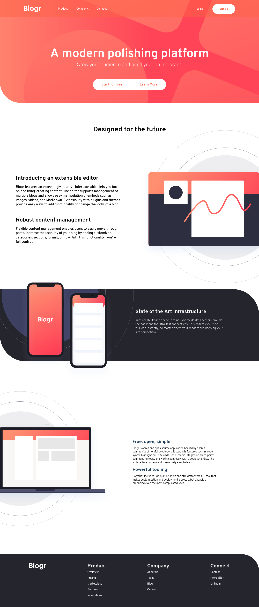

# BLOGR LANDING PAGE
## Table of contents

- [The challenge](#the-challenge)
- [Screenshot](#screenshot)
- [Links](#links)
- [Built with](#built-with)
- [What I learned](#what-i-learned)
- [Continued development](#continued-development)
- [Useful resources](#useful-resources)
- [Author](#author)

### The challenge

I needed to design a Blogr landing page as given by frontend mentor.com

### Screenshot

### Links

- Live Site URL: [blogr landing page](https://jaskaram123.github.io/blogrlandingpage/)

### Built with

- HTML5
- CSS

### What I learned

I learned how to handle position fixed for navbar. A practice of writing code by dividing webpage into smaller parts for an ease to write css.

### Continued development

I will add a animated pop up login form to it to make it more dynamic.

### Useful resources

- [learned about svgs from here](https://www.w3schools.com) - This helped me learn about svgs.

## Author
Jaskaramjit Singh
- Instagram - [artisticmusic__](https://www.instagram.com/artisticmusic__/)
- Frontend Mentor - [@jaskaram123](https://www.frontendmentor.io/profile/jaskaram123)
- Youtube - [Khidarinotlive](https://www.youtube.com/channel/UCfJJytAIVR4i4CIOoPxy2Gw)
- [(https://www.linkedin.com/in/sukhdeep-singh-b5848a1b1/)
